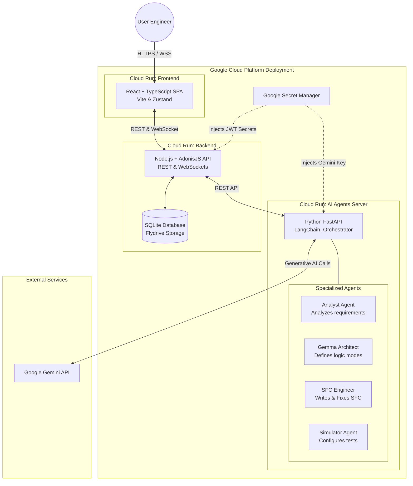

# 🏗️ Vibindu - Architecture Diagram (GCP & Agents)

This diagram illustrates the complete system architecture of **Vibindu**, showcasing how the React Frontend, Node.js Backend, and Python AI Agents interact, along with their deployment environment on **Google Cloud Platform (Cloud Run)**.

The system firmly integrates with the **Google Gemini API** to power our autonomous "Vibe Coding" engineering agents.

### Flow Summary:
1. **User Interaction**: The user describes an automation problem in the visual editor (Frontend).
2. **Relay**: The Frontend sends the prompt to the Backend via WebSocket/REST.
3. **Agent Orchestration**: The Backend forwards the payload to the Python Agents server.
4. **Vibe Coding Loop**: 
   - The *Analyst* identifies I/O variables.
   - The *Architect* defines operating modes.
   - The *SFC Engineer* writes logic via Gemini and sends it back to the Backend's syntax compiler. If it fails, it self-corrects based on the error.
   - The *Simulator* sets up the runtime.
5. **Result**: The validated GRAFCET diagram is pushed back to the User in real-time.
